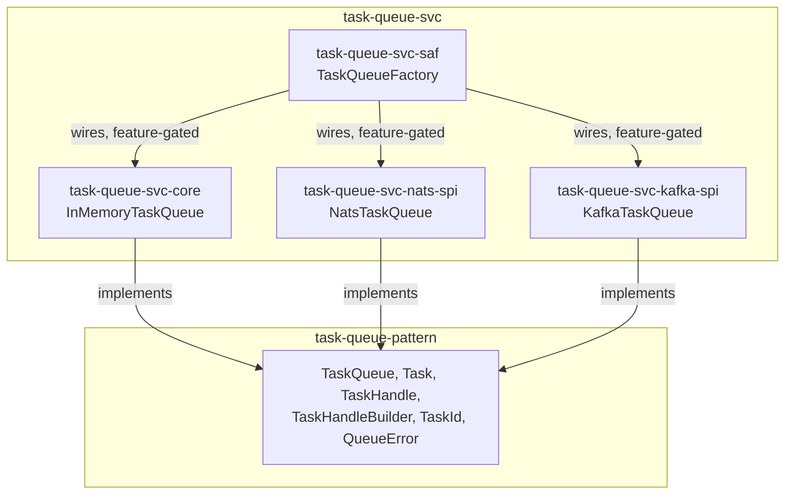

# task-queue-svc Architecture

**Audience**: Architects, technical leads, contributors.

## Overview

Four crates — one `core` reference implementation, two `spi` providers, and
one `saf` facade:

- **`task-queue-svc-core`** — the technology-free reference implementation:
  `InMemoryTaskQueue` (`tokio::sync::mpsc`).
- **`task-queue-svc-nats-spi`** — `NatsTaskQueue` (`async-nats` JetStream,
  competing-consumer groups).
- **`task-queue-svc-kafka-spi`** — `KafkaTaskQueue` (`rdkafka`).
- **`task-queue-svc-saf`** — `TaskQueueFactory` (`in_memory`/`nats`/`kafka`,
  no `postgres` constructor — that backend never had a `TaskQueue` in
  `edge-runtime`'s original pilot either). A consumer depends on
  `task-queue-pattern` + `task-queue-svc-saf` alone and never imports a
  `spi` crate directly.

Each crate depends on `task-queue-pattern` (the `TaskQueue` trait and value
types) and whatever technology client it wraps. Split out of
`message-broker-svc` — see [ADR-001](adr/ADR-001-split-from-message-broker-svc.md)
for the full reasoning, including what did and didn't need duplicating
across the split.

## Component Diagram

## No config-type duplication needed — but constants did need it

Checked before assuming: neither `NatsTaskQueue::connect` nor
`KafkaTaskQueue::new` used a config type (`NatsConfig`/`KafkaConfig`) at
all — both take raw parameters directly. So unlike
`message-broker-svc`'s own `nats-spi`/`kafka-spi` (each with a real
`Validator`-implementing config type), there was no config type to
duplicate across this split.

Tuning constants were a different story — `kafka-spi`'s `constants.rs` mixed
values used by both `KafkaMessageBroker` and `KafkaTaskQueue`
(`KAFKA_MESSAGE_TIMEOUT_MS`, `KAFKA_SESSION_TIMEOUT_MS`,
`KAFKA_HEALTH_CHECK_TIMEOUT_SECS`). Both crates now declare their own copy —
real duplication, not shared, matching this org's own SEA anti-pattern rule
("no cross-module shared utilities") applied at the repo-split level. See
ADR-001 for the full breakdown of what moved, what duplicated, and what
stayed behind.

## Dispatch: independent constructors per backend, no shared selection type

`TaskQueueFactory::in_memory()` / `::nats(nats_url, stream_name,
consumer_group)` / `::kafka(brokers, group_id, topic)` — three independent,
directly-typed, Cargo-feature-gated constructors, all returning `Box<dyn
TaskQueue>` uniformly (same reasoning `message-broker-svc`'s own
architecture doc gives for `MessageBrokerFactory`: a caller collecting
queues from more than one constructor into one `Vec` needs them to actually
be the same type — verified by
`kafka_task_queue_int_test.rs::test_kafka_and_in_memory_constructors_return_the_same_boxed_queue_type`).

## Scope boundary

This repo covers exactly `task-queue-pattern`'s `TaskQueue` trait, for three
backends. Not covered:

- **Postgres** — `edge-runtime`'s original pilot never had a `TaskQueue`
  backend for Postgres; `pgmq` has no competing-consumer concept to map
  onto it cleanly.
- **`MessageBroker`** implementations — those stay in `message-broker-svc`.

[← Docs index](../README.md)
